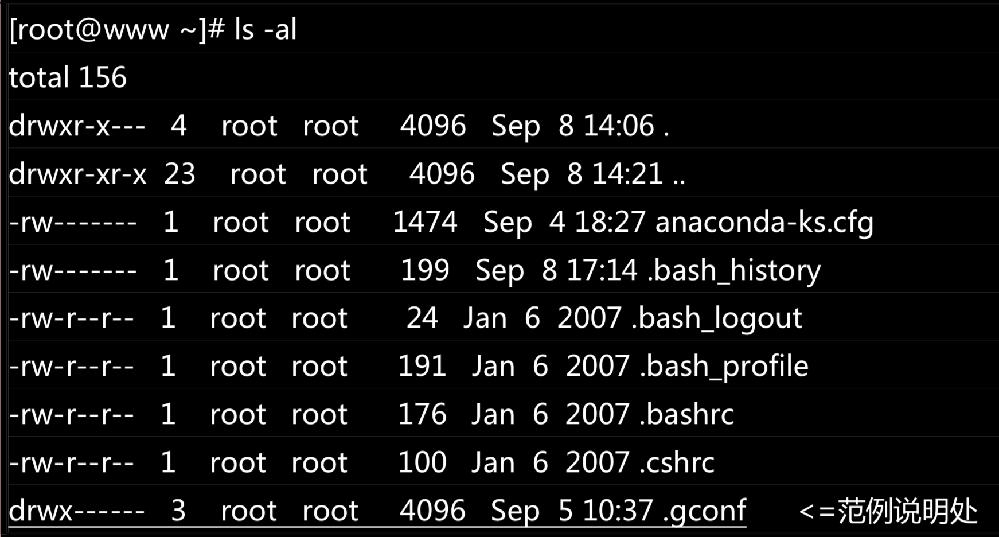
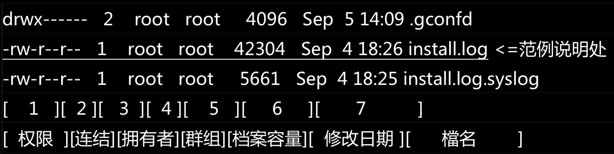

#Linux 之 档案权限与目录配置

Linux 最优秀的地方之一，就在与他的多人多任务环境。而为了让各个使用者具有较保密的档案数据，因此档案的权限 管理就变的很重要了。 Linux 一般将档案可存取的身份分为三个类别：
分别是 

1. __owner__
2. __group__
3. __others__

这三种身份各有:

1. __read__
2. __write__
3. __execute__

等权限。另外，你如果首次接触 Linux 的话会发现，在 Linux 底下这么多的目录/档案，到底每个目录/档案代表什么意义呢？ 接下我就来一一介绍!

##查看 Linux 文件属性

在 Linux 命令行下输入 `ls -al` 即可查看当前目录下所有文件、目录的详细信息



`ls` 是『list』的意思，重点在显示档案的文件名与相关属怅。而选顷 `-al` 则表示列出所有的档案详细的权限与属性 (包括隐藏文件，就是文件名第一个字符为『 . 』的档案)。如上所示，在你第一次以 root 身份登入 Linux 时， 如果你输入上述挃令后，应该有上列的几个东西，先解释一下上面七个字段分别代表什么意思



那么类似于 `drwxr-x---` 是什么意思呢？

___第一个字符代表这个档案是『目录、档案或链接文件等等』:___

1. 当为[ d ]则是目彔，例如上表档名为『.gconf』的那一行;
2. 当为[ - ]则是档案，例如上表档名为『install.log』那一行;
3. 若是[ l ]则表示为连结档(link file);
4. 若是[ b ]则表示为装置文件里面的可供储存的接口设备(可随机存取装置);
5. 若是[ c ]则表示为装置文件里面的串行端口设备，例如键盘、鼠标(一次性读取装置)。

__接下来的字符中，以三个为一组，且均为『rwx』 的三个参数的组合, 其中，[ r ]代表可读 (read)、[ w ]代表可写(write)、[ x ]代表可执行(execute)。 要注意的是，这三个权限的位置不会改变，如果没有权限，就会出现减号[ - ]而已。__

__不难发现，一共有三组『rwx』组合， 第一组为『档案拥有者的权限』, 第二组为『同群组的权限』，第三组为『其他非本群组的权限』__

```
question:

如果我的目录为底下的样式，请问 testgroup 这个群组的成员与其他人(others)是否可以进入本目录?
drwxr-xr-- 1 test1 testgroup 5238 Jun 19 10:25 groups
```

##如何改变文件属性与权限

如何修改一个档案的属性与权限呢? 有多少档案的权限我们可以修改呢? 其实一个档案的属性与权限有很多!我们先介绍几个常用于群组、拥有者、各种身份的权限的修改的命令，如下所示:

1. chgrp :改变档案所属群组
2. chown :改变档案拥有者
3. chmod :改变档案的权限

### 改变档案所属群组

改变所属群组的命令很简单： `chgrp [-R] [new group name] dirname/filename `

```
question:

是不是group name 可以随便输入呢？
```

```
练习

创建一个文件，并且改变该文件的群组
```

### 改变档案拥有者

改变档案拥有者的命令也很简单： `chown [-R] [new owner] dirname/filename`

```
question:

如何查看我的所有用户？
```

```
练习

创建一个文件，并且改变该文件的拥有者
```

```
question:

使用 cp 命令copy 的文件权限是什么呢？
```

### 改变档案权限

档案权限的改变使用的是 chmod 这个命令，但是，权限的设定方法有两种， 分别可以使用数字或者是
符号来进行权限的变更:

####数字类型改变档案权限

数字类型改变档案权限的命令是: `chmod [-R] [权数] dirname/filename`

Linux 档案的基本权限就只有九个，分别是 owner/group/others 三种身份各有自己的 read/write/execute 权限，各权限的分数对照表如下:

1. R: 4
2. W: 2
3. X: 1

```
question:

rwxr-xr-x 对应的数值是多少呢？
```

```
练习：

创建一个文件，将权限改为 rwxrwxrwx
```

####符号类型改变档案权限

从之前的介绍中我们可以发现，基本上就九个权限分别是(1)user (2)group (3)others 三种身份! 那么我们就可以藉由 u, g, o 来代表三种身份的权限!此外， a 则代表 all 亦即全部的身份!那么读写的权限就可以写成 r, w, x。举例如下：

`chmod u=rwx,g=rx,o=rx t1.txt`, 也可以缩写为  `chmod u=rwx,go=rx t1.txt`

为 group 用户增加写权限的命令

`chmod g+w t1.txt`

为 owner 用户去掉写权限的命令

`chmod u-w t1.txt`


##Linux 档案种类与扩展名

在我们介绍文章始终都在强调的就是:任何装置在 Linux 底下都是档案， 不仅如此，连数据沟通的接口也有专属的档案在负责~所以，Linux 的档案种类有很多种， 除了前面提到的一般 档案(-)与目彔档案(d)之外，还有哪些种类的档案呢?

* __正规档案(regular file ):__ 通常我们看到的以 `-`开头的文件
* __目录:__ 通常我们看到以 `d` 开头的文件
* __链接档案:__ 类似于windows 中的快捷方式，以 `l` 开头
* __设备与装置文件:__ 
	* 区块(block)设备档:以 `b` 开头，就是一些储存数据，以提供系统随机存取的接口讴备，举例来说就是硬盘和软盘。
	* 字符(character)设备文件: 以 `c` 开头，亦即是一些串行端口的接口设备， 例如键盘、鼠标等等。
* __资料接口文件(sockets):__ 以 `s` 开头，既然被称为数据接口文件，这种类型的档案通常被用在网络上的数据承接。我们可以启动一个程序来监听客户端的要求，而客户端就可以透过这个socket来进行数据的沟通。
* __数据输送文件(FIFO, pipe):__ 以 `p` 开头，FIFO 也是一种特殊的文件类型，他主要的目的在解决多个程序同时存取一个档案所造成的错误问题, FIFO 是 first-in-first-out 的缩写。

### Linux 档案扩展名

基本上，Linux 的档案是没有所谓的『扩展名』的，我们刚刚就谈过，一个 Linux 档案能不能被执行，与他的第一栏的十个属性有关，与文件名根本一点关系也没有。所谓的扩展名只是让我们能够更加清楚的认识到文件的用途。

```
question:

运行如下两个命令是否会报错？
tar -cvf zipedFile t1.txt
tar -xvf zipedFile
```

### Linux 档案长度限制

```
quesiont:

单一档案戒目彔的最大容讲文件名为 ？ 个字符;
包含完整路径名称及目录 (/) 的完整档名为 ？个字符
```

单一档案戒目彔的最大容讲文件名为 <span style="color:black;background-color:black">255</span> 个字符;

包含完整路径名称及目录 (/) 的完整档名为 <span style="color:black;background-color:black">4096</span> 个字符

## Linux 目录配置

因为利用 Linux 来开发产品或 distributions 的社群/公司不个人实在太多了， 如果每个人都用自己的想法来配置档案放置的目录，那么将可能造成很多管理上的困扰。所以后来就有所谓的 Filesystem Hierarchy Standard (FHS) 标准的出炉了!

亊实上，FHS 是根据过去的经验一直再持续的改版的，FHS 依据文件系统使用的频繁与否与是否允许使用者随意改动，而将目录定义成为四种交互作用的形态，用表格来说有点像底下这样:

| | 可分享的(shareable)|  不可分享的(unshareable) |
| --------- | --------- | --------- |
| 不变的(static) | /usr (软件放置处) | /etc (配置文件)|
|  | /opt (第三方协力软件) |       /boot (开机与核心档)|
| 可变动的(variable)|/var/mail (使用者邮件信箱)| /var/run (程序相关)|
| |/var/spool/news (新闻组)|  /var/lock (程序相关)|

事实上，FHS 针对目录树架构仅定义出三个目录底下应该放置什么数据而已，分别是底下这三个目录的定义:

* / (root, 根目录): 与开机系统有关;
* /usr (unix software resource): 与软件安装/执行有关;
* /var (variable): 与系统运作过程有关。

###根目录 (/) 的意义与内容

根目录是整个系统最重要的一个目彔，因为不但所有的目录都是由根目录衍生出来的， 同时根目录也与 开机/还原/系统修复等动作有关。 由于系统开机时需要特定的开机软件、核心档案、开机所需程序、 函式库等等档案数据，若系统出现错误时，根目录也必项要包含有能够修复文件系统的程序才行。 因为根目录是这么的重要，所以在 FHS 要求根目录下不能有太多子目录。常用的子目录如下：

|  目录|  应放置的内容|
| --------- | ---------  |
| /bin  | 系统有很多放置执行文件的目录 |
| /boot | 这个目录主要在放置开机会使用到的档案，包括 Linux 核心档案以及开机所需配置文件等等 |
| /dev  | 在 Linux 系统上，任何装置与接口设备都是以档案的型态存在于这个目彔当中的。 |
| /etc  |系统主要的配置文件几乎都放置在这个目录内|
| /home | 这是系统默认的用户主目录(home directory)。|
| /lib | 系统的函数库非常的多，而/lib 放置的则是在开机时会用到的函数库， 以及在/bin或/sbin底下的命令会呼叫的函数库而已 |
| /media | media 是『媒体』的英文，顺名怃丿，这个/media 底下放置的就是可移除的装置，比如软盘、光盘|
| /mnt | 如果妳想要暂时挂载某些额外的装置，一般建议妳可以放置到这个目彔中 |
| /opt | 这个是给第三方协力软件放置的目彔 |
| /root | 系统管理员的主目录 |
| /sbin | 放在/sbin 底下的为开机过程中所 需要的，里面包括了开机、修复、还原系统所需要的指令|
| /srv | srv 可以视为『service』的缩写，是一些网络服务启动以后，这些服务所需要取用的数据目录，常见的服务例如 WWW, FTP 等等 |
| /tmp | 这是让一般用户戒者是正在执行的程序暂时放置档案的地方。 |

###/usr的意义与内容

很多读者都会误会/usr 为 user 的缩写，其实 usr 是 Unix Software Resource 的缩写， 也就是『Unix 操作系统软件资源』所放置的目录，而不是用户的数据。 这点要注意。 FHS 建议所有软件开发者，应该将他们的数据合理的分别放置到这个目录下的次目录，而不要自行建立该软件自己独立的目录。一般来说，/usr 的次目录建议有如下这些:

|  目录|  应放置的内容|
| --------- | ---------  |
| /usr/bin/ | 绝大部分的用户可使用指令都放在这里!请注意到他与/bin 的不同之处。(是否与开机过程有关)|
| /usr/include/| c/c++等程序(header)与(include)放置处|
| /usr/lib/ |包含各应用软件的函式库、目标档案(object file)，以及不被一般使用者惯用的执行文档或脚本(script)。|
|/usr/local/| 系统管理员在本机自行安装自己下载的软件，建议安装到此目录，这样会比较便与管理|
|/usr/sbin/| 非系统正常运作所需要的系统挃令。最常见的就是某些网络服务器软件的服务指令|
|/usr/share/| 放置共享文件的地方，在这个目录下放置的数据几乎是不分硬件架构均可读取的数据，几乎都是文本文件|
|/usr/src/| 一般原始码建议放置到这里，src 有 source 的意怃。至于核心原始码则建议放置 到/usr/src/linux/目录下。|

###/var 的意与不内容

如果/usr 是安装时会占用较大硬盘容量的目录，那举/var 就是在系统运作后才会渐渐占用硬盘容量的目录。 因为/var 目录主要针对常态性变动的档案，包括快取(cache)、登录文档(log file)以及某些软件运作所产生的档案，包括程序档案(lock file, run file)，或者例如 MySQL 数据库的档案等等。常见的次目录有:

|  目录|  应放置的内容|
| --------- | ---------  |
|/var/cache/|应用程序本身运作过程中会产生的一些暂存档;|
|/var/lib/|程序本身执行的过程中，需要使用到的数据文件放置的目录。|
| /var/log/|重要到不行!这是登录文件放置的目录!|
|/var/mail/|放置个人电子邮件信箱的目彔，不过这个目彔也被放置到/var/spool/mail/目录中! 通常这两个目录是互为链接文件|
|/var/run/|某些程序或者是服务运行后，会将他们的 PID 放置在这个目录下|
|/var/spool/|这个目录通常放置一些队列数据，所谓的『队列』就是排队等待其他程序使用的数据|

    
